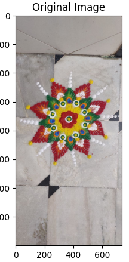
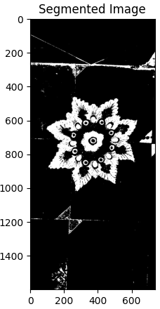
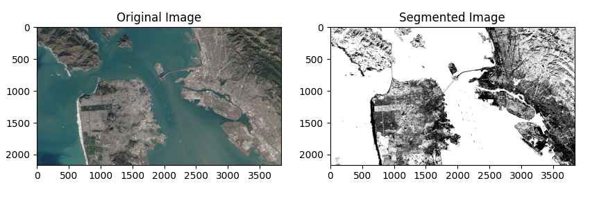

This folder contains code for performing segmentation using morphological operations.

## Reference Papers  
[Fuzzy Numerical Morphological approach for Super Resolution of MR Brain Images](https://ieeexplore.ieee.org/document/9688525)  

## Examples  

    

