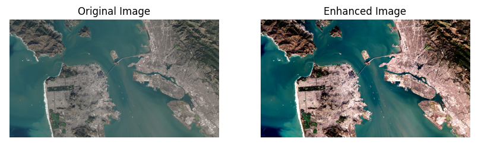
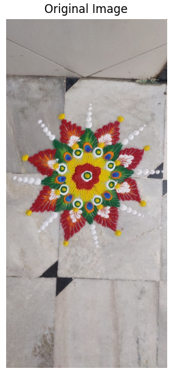
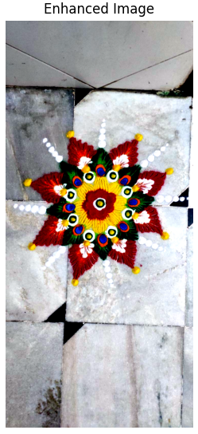

This folder contains code for performing Image Enhancement using Spatial Filtering.  

## Reference Paper  
[An Atomic Technique For Removal Of Gaussian Noise From A Noisy Gray Scale Image Using LowPass-Convoluted Gaussian Filter](https://ieeexplore.ieee.org/document/8862330)

## Example Images  

  
